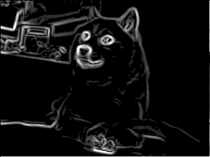

# imgtool

A command-line image processing tool that applies a configurable pipeline of transforms to an image.

**Doge**


**Transformed Doge**
(grayscale -> blur -> sobel -> threshold)




## Build

```sh
cmake -B build && cmake --build build
```

## Usage

```
imgtool <input> <output> [transform...]
imgtool --batch <input_dir> <output_dir> [transform...]
```

Transforms are applied left to right. Multiple transforms can be chained. With `--batch`, all `.png` files in `<input_dir>` are processed concurrently and written to `<output_dir>`.

### Transforms

| Transform                                                            | Syntax                    | Description                            |
| -------------------------------------------------------------------- | ------------------------- | -------------------------------------- |
| Grayscale                                                            | `grayscale`               | Convert to grayscale                   |
| [Gaussian blur](https://en.wikipedia.org/wiki/Gaussian_blur)         | `blur` or `blur:<radius>` | Blur with optional radius (default: 2) |
| [Sobel edge detection](https://en.wikipedia.org/wiki/Sobel_operator) | `sobel`                   | Detect edges                           |
| Threshold                                                            | `threshold:<value>`       | Binarize at given intensity (0–255)    |

### Examples

```sh
# Convert to grayscale
imgtool images/input.png images/output.png grayscale

# Blur then detect edges
imgtool images/input.png images/edges.png blur:3 sobel

# Full edge-detection pipeline
imgtool images/input.png images/result.png grayscale blur sobel threshold:128

# Batch process a directory
imgtool --batch images/inputs images/outputs grayscale blur:3 sobel threshold:80
```

